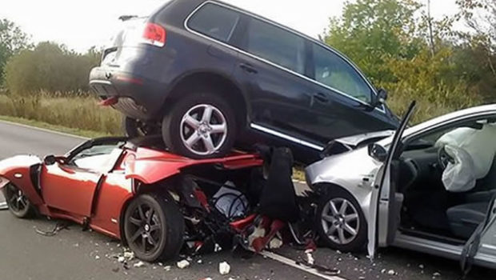
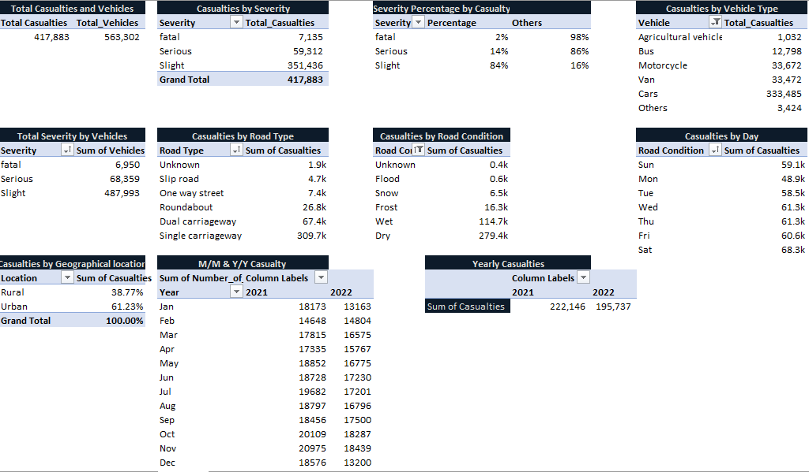
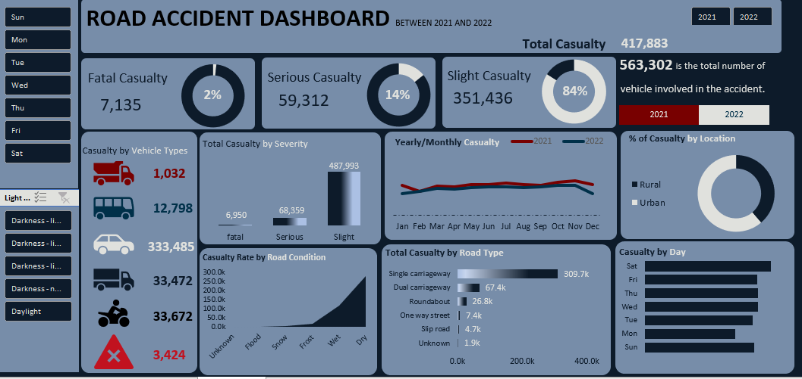
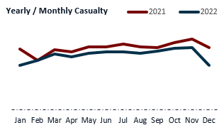

# Road-Accident-Analysis

---

## Introduction
This is an Excel project on road accident analysis between 2021 and 2022. 
The project aims to analyze and derive insights to answer crucial questions and help stakeholders make data-driven decisions.
The stakeholders include: the Ministry of Transport, Police force, Road Safety Corps, Traffic Management Agencies, Road Transport Department, Emergency Service Department, Media, and the General public.

## Problem Statement
1. What is the total casualty after the accident?
2. What is the total casualty with respect to accident severity and the percentage of the total?
3. What is the total casualty w.r.t vehicle type?
4. What is the Monthly and Yearly trend of the casualty?
5. How many casualties by road type?
6. How many casualties by road surface?
7. What is the relationship between casualties by area/location and by weekday?

## Skills/ Concepts Demonstrated
The following Excel features were incorporated:
Sort and Filter, Find and Replace, Text Function, Number Formatting, Data type, Pivot Table.
- Good use of formatting and layout.
- Use of insightful charts.
- Analytical approach to the problem.
  ### Here is the Pivot Table😄
  
  

## Data Source
This is not a real dataset. I sourced the dataset from Kaggle to demonstrate my use of Microsoft Excel in analyzing data.

## Modelling
The dataset does not require modeling because it's only one table / Sheet. 

## Analysis and Visualization

This is the visual of the road accident analysis. From 2021 to 2022, there was a total of 417,883 casualties categorized into 3 severity, fatal, Slight, and Serious.

---

The yearly and monthly trends showed that there is much casualty in 2021 compared to 2022 and there was a very high casualty rate in October and November of both years.

## Conclusion
- The data reveals a total of 417,883 casualties in 2021 and 2022.
- Those involved in slight accidents are much higher than those involved in fatal accidents.
- Car casualty is three hundred times higher than motorcycle and van casualties. 
- Massive accidents occurred in 2021 in all the months of the year. The two years had low casualties in February and the highest in November. The drop in casualties in 2022 could be 
  attributed to the development of road conditions. 
- There are many casualties in single-carriageway road types compared to other road types. There is a recorded number of accidents that we do not know what caused it but the amount of 
  casualties are low. 
- There is a recorded amount of accidents on dry and wet roads. This can be due to rainfall but during the flood season, there are fewer accidents occurrence. 
- The rural area has fewer casualties than the urban area, which is thirty times greater. Most accidents happen on Saturday and less on Monday, while Wednesday and Thursday have the same 
  number of casualties.  

## Recommendations

- **Identify Growth Components:** The stakeholders should pinpoint the primary factors that led to fewer casualties in 2022. This will help replicate the success in future years. 
- **Promote Weather Condition Broadcast:** Implement broadcasting the weather and road conditions to people. The awareness would discourage people from leaving their houses during harsh 
  weather conditions.
- **Road Development:** The stakeholders should expand the roads, most especially the urban areas as there are more people living in the city than in rural areas. 
- **More Hands-on Deck:** More officers should be employed and distributed to many locations most especially on weekends and festive periods. 
- **Recognition and Awards:** Recognizing officers for their outstanding performance can motivate and inspire the team.
- **Train Means of Transportation:** To reduce the number of cars on the road, trains should be built to discourage more cars on the roads. 
- **Reasons for Unknown Data:** All information regarding the unknown data should be tracked down to help the stakeholders know how to tackle the casualty.

  ## Thank you😃
  
  

